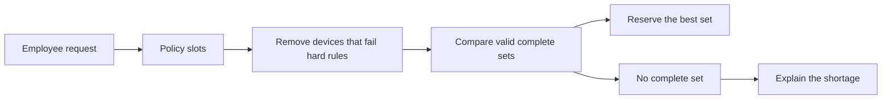

# IT Inventory

A small operations application for registering IT equipment and allocating the best available set to an employee from a role-based equipment policy.

## Run it

Requirements: Docker with Docker Compose.

```bash
docker compose up --build
```

Open <http://localhost:8088>. The first startup builds both applications, runs Flyway migrations, and inserts sample inventory. PostgreSQL data is kept in the `inventory-postgres` volume, so the Flyway seed migration runs only once for that database.

To stop the application:

```bash
docker compose down
```

To reset the database and reload seed data:

```bash
docker compose down --volumes
docker compose up --build
```

## Architecture

- `backend`: Kotlin, Spring Boot 4.1, Spring Data JPA, PostgreSQL, Flyway, Gradle
- `frontend`: Angular 22 standalone components, served by nginx
- nginx sends `/api/*` to the backend; the browser never needs a separate backend URL or CORS configuration
- Flyway owns the schema and seed data; Hibernate validates the schema rather than generating it

The API uses uppercase enum values (`MAIN_COMPUTER`, `AVAILABLE`, and so on). The UI translates them into readable labels.

## Allocation algorithm

### The short version

An allocation request is a shopping list for one employee, such as “one laptop with condition
at least 0.80, preferably Apple, plus two monitors.” The allocator chooses a **complete set of
different available devices** for that list.



In practice:

1. Remove devices with the wrong type or a condition below the slot’s minimum.
2. Compare the remaining combinations as one group, so one slot cannot steal the only valid
   device from another slot.
3. Prefer, in order: matching brand, newer purchase date, higher condition, then lower id.
4. Reserve the winning set in one transaction, or store a clear failure reason if no complete
   set exists.

Choosing the whole set matters. With two monitor slots—one requiring condition ≥ 0.85 and one
preferring LG—the allocator can give the 0.90 LG monitor to the strict slot and the 0.80 Dell
monitor to the other slot. A one-at-a-time choice could make the request fail unnecessarily.

Devices move through `AVAILABLE → RESERVED → ASSIGNED`. Cancelling a reservation releases all
reserved devices; returning a confirmed allocation releases only the individual device that was
returned. The allocation record remains as history.

<details>
<summary>Technical implementation details</summary>

### The problem

A policy is a list of slots. Each slot names an equipment type, optionally a minimum
condition score, optionally a preferred brand, and whether newer equipment is preferred:

> 1 laptop with condition >= 0.8, prefer Apple; 2 monitors

The service must pick one distinct available item per slot such that every hard constraint
holds and the soft preferences are satisfied as well as possible across the *whole* set --
or, if no such set exists, fail with a reason an operator can act on.

Three things make this harder than it looks.

- **Hard constraints are structural, not expensive.** A pairing that violates type or minimum
  condition must be impossible, not merely penalised. Penalties fail the moment soft
  preferences accumulate past them.
- **Items compete across slots.** Two monitor slots share one monitor pool. Deciding one slot
  in isolation can consume the only item another slot could have used.
- **Distinctness is implicit.** "2 monitors" means two different physical monitors.

### The model: a flow network

Allocation builds a bipartite flow graph:

```
source --(1)--> slot_i --(1, cost = -score)--> item_j --(1)--> sink
```

- One node per policy slot, one per available item of a requested type.
- An edge from a slot to an item exists **only if** the item meets the slot's hard
  constraints (`meetsHardConstraints` in `AllocationMatcher.kt`). Ineligible pairs are absent
  from the graph, which is what makes hard constraints structural.
- Every edge has capacity 1. The unit capacity on `item -> sink` is what enforces
  distinctness: an item can carry flow to at most one slot.
- The slot-to-item edge cost is the negated preference score, so minimising cost maximises
  preference.

A **successive-shortest-augmenting-path min-cost max-flow** solver then pushes one unit of
flow per slot. Max-flow settles feasibility (can every slot be filled?), min-cost settles
optimality (of all complete assignments, which scores highest?). One pass settles both.
The shortest-path step is SPFA (queue-based Bellman-Ford): costs are negative and residual
edges flip sign, so plain Dijkstra would need potentials.

### Why not greedy

Consider the case the brief calls out -- two monitor slots and three available monitors:

| Monitor | Brand | Condition |
| --- | --- | --- |
| M1 | LG | 0.90 |
| M2 | Dell | 0.80 |
| M3 | Dell | 0.70 |

Policy: **slot A** = monitor, minimum condition 0.85. **slot B** = monitor, prefer LG.

Greedy fills slot B first, because that is the slot with a preference to satisfy. The only
LG is M1, so B takes M1. Slot A now needs a monitor at 0.85 or better, and only M2 (0.80)
and M3 (0.70) remain. **The request fails**, even though a valid allocation exists: M1 to
slot A (0.90 clears its minimum) and M2 to slot B (no LG available, but the slot has no hard
constraint). Two items allocated, zero constraints violated.

Greedy fails whichever order it uses, because the problem is structural: a greedy choice
for one slot can consume the only item another slot could have used, and greedy has no way
to undo that choice. Min-cost max-flow does not have this problem: augmenting paths can push
flow *back* along residual edges, so an early assignment is revisited automatically when a
later slot needs that item more. The solver either returns the globally highest-scoring
complete assignment or proves none exists. `AllocationScoringTest` pins this exact instance and the M1-to-A, M2-to-B assignment;
`AllocationShortfallsTest` pins that the diagnosis stays silent on it.

### Scoring: strict priority tiers

Soft preferences are combined into one edge score, but as **strict tiers**, not a blend.
The documented order is brand > recency > condition > id, and the implementation guarantees
it: each tier is a multiplicative unit chosen so that

> unit(tier) > maximum combined contribution of every tier below it

| Tier | Signal | Range | Unit |
| --- | --- | ---: | ---: |
| 1 | Preferred brand matches | 0 or 1 | 10^16 |
| 2 | Recency, if `preferRecent` (100 000 - age in days) | 0 - 100 000 | 10^10 |
| 3 | Condition score in hundredths | 0 - 100 | 10^7 |
| 4 | Id tie-break (10^7 - id) | 0 - 9 999 999 | 1 |

So a brand match (10^16) beats any recency advantage (at most 10^15), one day of recency
(10^10) beats any condition advantage (at most 10^9), and one hundredth of condition (10^7)
beats any id advantage (at most 10^7 - 1). No accumulation of lower-priority signals can
outvote a higher-priority one. `AllocationMatcher.tierInvariantsHold()` states the rule and
`AllocationScoringTest` asserts it, alongside one test per tier boundary that sets the
higher tier against the *maximum* swing of everything below it.

The units are also bounded from above. SPFA sums edge costs along a residual path that can
cross every slot the API allows (50), so 50 x the maximum edge score must stay inside
`Long`. It does, with a margin of about 16x, and a test pins that too.

Two consequences:

- **Recency is sharp.** An item purchased one day later beats one in far better condition,
  as long as both clear the slot's hard minimum. That is the literal meaning of "prefer
  newer equipment". If months or model year fit the business better, change the `ageDays`
  line in `AllocationMatcher.score()`.
- **The tie-break covers ids below ten million.** Beyond that every item ties at zero and
  order falls back to candidate order, which the repository already fixes as ascending id.

### Failure diagnosis

When the solver cannot fill every slot, the request is stored as `FAILED` with a
`failureReason` the UI shows verbatim. The reason is **exact**.

The hard constraints are only type and minimum condition, so within a type every slot's
candidate set is a *threshold set* -- all items at or above the slot's minimum -- and
threshold sets are nested: a tighter slot's candidates are a subset of a looser slot's.
For nested sets, Hall's marriage condition collapses to one check per distinct threshold:

> the number of slots demanding at least that minimum must not exceed the number of items
> meeting it

Types never share candidates, so the checks are independent across types. `AllocationShortfalls`
walks each type's thresholds from tightest to loosest, accumulating demand while supply
widens, and reports every threshold where demand exceeds supply. The solver stays the authority
on feasibility; the diagnosis only explains. A randomised test confirms they agree on every
instance: the diagnosis finds a shortfall if and only if the matcher returns no assignment.

The earlier implementation counted compatible items per type at the loosest minimum and
so missed competition between slots of the same type. Two monitor slots, one needing 0.90 and
one needing anything, against stock at 0.50 and 0.60: two monitors, two wanted, "no
shortage" -- yet the 0.90 slot has nothing. The new diagnosis says so:

> No valid equipment set is available (monitor: 1 slot needs condition >= 0.90, 0 available).

And for the competing-slots case with two slots at 0.85 against stock at 0.90, 0.80, 0.70:

> No valid equipment set is available (monitor: 2 slots need condition >= 0.85, 1 available).

`failure_reason` is `TEXT` (migration `V3`), so even a 50-slot policy failing on every
threshold is explained in full rather than truncated to fit a column.

Both the matcher and the diagnosis decide eligibility through one predicate,
`PolicySlotRequest.accepts(item)`. That is what keeps them in agreement: a new hard
constraint added there reaches both, and a randomised test asserts they still agree. The
service normalises each slot once (`normalised()` trims the brand) and hands the same values
to the matcher, the diagnosis and the persisted policy, and `@Digits(1, 2)` on
`minimumCondition` keeps requests at the column's `NUMERIC(3,2)` scale -- so the threshold
the matcher enforces is the one Postgres stores and the failure reason reports.

### Complexity

For `S` slots, `E` eligible equipment items, `V = S + E + 2` graph vertices, and
`A <= S x E` compatibility edges, the implementation's conservative worst-case bound is
`O(S x V x A)` time and `O(V + A)` space. The SPFA pass is usually far faster than that
bound; see the measured numbers below. The failure diagnosis is `O(S log S + S x E)` and
runs only on the failure path.

### Trade-offs against simpler alternatives

| Approach | Optimal? | Complexity | Why not this |
| --- | --- | --- | --- |
| Per-slot greedy | No | `O(S x E)` | Fails the competing-slots case above |
| Backtracking / exhaustive search | Yes | Exponential | Fine for 2 slots, unusable at the 50-slot API limit |
| Hungarian algorithm | Yes | `O(n^3)` on a padded square matrix | Equivalent result, but pads to `max(S, E)^2` -- wasteful when `E >> S`, which is the normal case here |
| **Min-cost max-flow (chosen)** | Yes | `O(S x V x A)` worst case | Scales with actual edges, not padded matrix size |

The price is more code than a sorted greedy pass. For very large inventories it could be
improved with Johnson potentials plus Dijkstra instead of SPFA, more aggressive
pre-filtering before graph construction, or an external optimisation solver. The current
approach is deterministic, easy to test, and appropriate for an operations inventory where
requests contain relatively few slots.

### Measured performance

Measured with `./gradlew :backend:benchmark` (`AllocationMatcherBenchmark`): a seeded catalogue of **5 000 equipment items**, 50 warmup and 300 measured iterations per scenario, OpenJDK 21.0.9 in the `gradle:9.2-jdk21` container on a 12-core machine. Candidate counts differ per scenario because only items of a requested type are eligible.

| Scenario | Candidates | p50 | p90 | p99 | max |
| --- | ---: | ---: | ---: | ---: | ---: |
| 1 laptop, condition >= 0.8, prefer Apple | 1 211 | 0.124 ms | 0.231 ms | 0.565 ms | 3.129 ms |
| 1 laptop + 2 monitors | 2 514 | 0.474 ms | 1.494 ms | 1.629 ms | 2.770 ms |
| Full desk setup (4 slots) | 5 000 | 0.666 ms | 0.971 ms | 2.440 ms | 3.034 ms |
| Contended: 10 monitors, tight minimums | 1 303 | 0.511 ms | 2.244 ms | 3.404 ms | 4.198 ms |
| Worst case: 50 slots (API maximum) | 5 000 | 31.764 ms | 34.221 ms | 41.502 ms | 80.231 ms |
| Unsatisfiable (minimum above every item) | 1 211 | 0.073 ms | 0.085 ms | 0.120 ms | 0.208 ms |

What the numbers say:

- **Realistic policies finish in under 2 ms at p99.** The brief's one-laptop-plus-two-monitors policy runs at 0.47 ms p50 against 2 514 candidates.
- **Cost scales with slot count, not catalogue size.** Each slot needs one augmenting path, so 50 slots cost roughly 50x the 1-slot case though both scan the same catalogue. Graph construction is linear in candidates.
- **Failure is the fastest path.** An unsatisfiable policy returns in 0.07 ms: the first augmentation finds no path and the solver exits at once.
- **Matching is not the bottleneck.** Even the pathological 50-slot request stays under 42 ms at p99 (the 80 ms max is a single outlier, consistent with a GC pause). `AllocationService.create` holds a pessimistic row lock for the whole window, so lock contention will dominate under concurrency long before the algorithm does. If 50-slot policies become common, replace SPFA with Johnson potentials plus Dijkstra.

The benchmark is a wall-clock harness, not JMH. It characterises the curve and catches regressions; microsecond precision would need JMH with blackholes and forked JVMs.

Creation runs in one transaction and pessimistically locks all available equipment rows of the requested types before matching. The chosen items become `RESERVED` atomically, preventing concurrent requests from receiving the same item. Confirm changes them to `ASSIGNED`; cancel returns them to `AVAILABLE`; returning a confirmed device releases that device alone. Allocation-item rows remain as history after each transition.

</details>

## REST API

| Method | Path | Purpose |
| --- | --- | --- |
| `POST` | `/equipments` | Register equipment |
| `GET` | `/equipments?state=&type=` | List and filter equipment |
| `GET` | `/equipments/{id}` | Get one equipment record |
| `POST` | `/allocations` | Create and immediately attempt an allocation |
| `GET` | `/allocations` | List requests |
| `GET` | `/allocations/{id}` | Get policy, state, and allocated items |
| `POST` | `/allocations/{id}/confirm` | Assign reserved items |
| `POST` | `/allocations/{id}/cancel` | Release reserved items |
| `POST` | `/allocations/{id}/items/{equipmentId}/return` | Return one assigned device |

Example request:

```json
{
  "employeeId": "EMP-1042",
  "policy": [
    {
      "type": "MAIN_COMPUTER",
      "minimumCondition": 0.8,
      "preferredBrand": "Apple",
      "preferRecent": true
    },
    { "type": "MONITOR" },
    { "type": "MONITOR" }
  ]
}
```

## Design system

Theme values live as CSS custom properties at the top of `frontend/src/styles.css`; every rule reads from them, so a rebrand is a change to that one block.

| Token | Value |
| --- | --- |
| `--color-primary` / `--color-accent` | `#FF6C1B` |
| `--color-on-primary` | `#171614` |
| `--color-secondary` | `#252E38` |
| `--color-text` | `#171614` |
| `--color-link` | `#1F6FB5` |
| `--radius` | `0px` |
| `--font-heading` / `--font-body` | Overused Grotesk, Arial, sans-serif |
| `--font-mono` | IBM Plex Mono |
| `--size-h1` / `--size-h2` / `--size-body` | 56px / 20px / 18px |
| `--space-1` … `--space-10` | 4px base unit |

Two deliberate deviations from the supplied brand sheet, both for WCAG AA:

- **Labels on `#FF6C1B` are `#171614`, not white.** White on the brand orange measures 2.83:1, below even the 3:1 floor for UI components. Near-black gives 6.38:1 and leaves the brand colour itself untouched.
- **Links are `#1F6FB5`, not `#3898EC`.** The brand blue is 3.06:1 on white; the darkened variant is 5.25:1.

Fonts load from CDNs with the brand sheet's own Arial fallback, so a blocked or slow CDN degrades the page rather than breaking it. For production, self-host both families under `frontend/public/fonts/` and swap the `<link>` tags in `index.html` for local `@font-face` rules.

## Code quality

Both stacks have static analysis wired up.

```bash
# Kotlin — style and code smells
./gradlew :backend:ktlintCheck :backend:detekt
./gradlew :backend:ktlintFormat        # autofix

# Angular / TypeScript — includes template accessibility rules
cd frontend && npx eslint src
```

`eslint.config.js` runs typed linting (`projectService`) so rules needing the type checker work, and enables `angular-eslint`'s template accessibility ruleset alongside `prefer-signals` and `prefer-inject` to keep the codebase signal-first and zoneless.

detekt's tool classpath is pinned to Kotlin 2.0.21 in `backend/build.gradle.kts`: detekt 1.23.x refuses to run against the project's 2.2.21 compiler, and detekt 2.x is still alpha. detekt analyses on an isolated classpath, so this does not affect how the project compiles. Revisit once detekt 2.x is stable.

## Development and tests

Backend tests through the Gradle wrapper:

```bash
./gradlew :backend:test           # unit tests (benchmarks excluded)
./gradlew :backend:benchmark      # allocation latency benchmark
```

Frontend development (Node 24.15+, which the Angular 22 CLI requires):

```bash
cd frontend
npm ci
npm start
```

The Angular development proxy expects the backend at `localhost:8080`. The production Compose setup exposes only the combined UI/API entry point at port `8088`.
